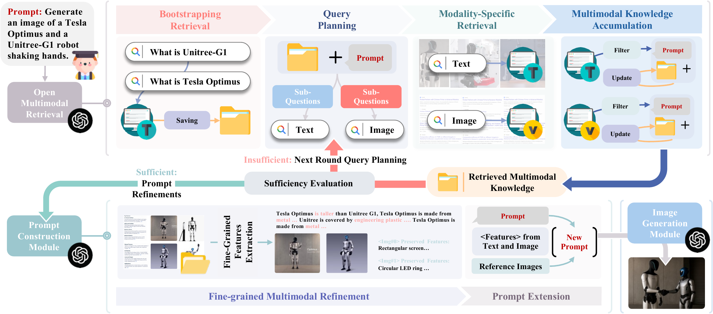

# ORIG: Open Multimodal Retrieval-Augmented Factual Image Generation

> **[ACM MM 2026]** An agentic open multimodal retrieval-augmented framework that grounds image generation in verifiable, evolving web knowledge.

## Authors

**Yang Tian**<sup>1</sup>\*, **Fan Liu**<sup>2</sup>†, **Jingyuan Zhang**<sup>3</sup>, **Wei Bi**<sup>4</sup>, **Yupeng Hu**<sup>1</sup>, **Liqiang Nie**<sup>5</sup>†

<sup>1</sup> Shandong University  
<sup>2</sup> Southeast University  
<sup>3</sup> Kuaishou Technology  
<sup>4</sup> Independent Researcher  
<sup>5</sup> Harbin Institute of Technology, Shenzhen  
\* Work done during an internship at Kuaishou Technology.  
† Corresponding authors

## Links

- **Paper**: [`ACM DL`](https://doi.org/10.1145/3767308.3835240)
- **Code Repository**: [`GitHub`](https://github.com/iLearn-Lab/MM26-FIG)

---

## Table of Contents

- [Updates](#updates)
- [Introduction](#introduction)
- [Highlights](#highlights)
- [Method / Framework](#method--framework)
- [Project Structure](#project-structure)
- [Installation](#installation)
- [Dataset / Benchmark](#dataset--benchmark)
- [Usage](#usage)
- [Results](#results)
- [TODO](#todo)
- [Citation](#citation)
- [Acknowledgement](#acknowledgement)
- [License](#license)

---

## Updates

- [08/2026] Release code, FIG-Eval prompts, and evaluation scripts
- [2026] ORIG is accepted by ACM Multimedia 2026

---

## Introduction

Large Multimodal Models (LMMs) generate photorealistic and prompt-aligned images, but they often produce outputs that **contradict verifiable knowledge**, especially when prompts involve fine-grained attributes or time-sensitive events. Conventional retrieval-augmented approaches introduce external information, yet remain fundamentally limited by two factors:

- **Static or closed-domain sources** — reliance on parametric memory or pre-built corpora leaves models unable to capture new facts, evolving entities, or time-sensitive events.
- **Shallow evidence integration** — text and images are processed separately, or retrieved images are treated as stylistic guidance rather than concrete grounding evidence.

We formalize **Factual Image Generation (FIG)** as a new task: an open-world generation setting where the input prompt specifies only a coarse intent while many image-critical facts remain implicit and must be inferred and grounded in verifiable real-world knowledge. Factual consistency is characterized along three dimensions:

| Dimension                          | Definition                                                   |
| ---------------------------------- | ------------------------------------------------------------ |
| **Perceptual Fidelity (PF)**       | Faithful rendering of entity-specific appearance and visual details |
| **Compositional Consistency (CC)** | Correctness of physical attributes and spatial relations     |
| **Temporal Consistency (TC)**      | Accurate depiction of event timing and evolving entity states |

To solve this task we propose **ORIG**, an agentic **O**pen multimodal **R**etrieval-augmented framework for **I**mage **G**eneration. Unlike conventional one-shot retrieval, ORIG follows an iterative workflow that plans sub-queries, retrieves modality-specific evidence from the open web, filters it through sufficiency evaluation and cross-modal filtering, and incrementally distills the refined knowledge into enriched prompts. To support systematic evaluation, we build **FIG-Eval**, a benchmark of 514 knowledge-intensive prompts spanning ten entity classes with 4,093 human-annotated question-answering items.

This repository provides:

- The full ORIG pipeline (open multimodal retrieval, prompt construction, and image generation)
- Retrieval backbones based on GPT-5 and Qwen2.5-VL
- The FIG-Eval prompt set, reference evidence, and the automated evaluation script

---

## Highlights

- Formalizes **Factual Image Generation (FIG)**, a new task setting emphasizing factual grounding in addition to visual realism
- **FIG-Eval**: 514 validated prompts across ten entity classes and 4,093 expert-annotated true/false QA items covering three concept categories
- **Agentic open-web retrieval**: iterative query planning, modality-specific retrieval, coarse-to-fine multimodal filtering, and adaptive sufficiency evaluation
- Consistent gains across three generators — **GPT-Image 32.1 → 50.1**, **Gemini-Image 34.6 → 51.4**, **Qwen-Image 19.0 → 39.7** — outperforming agentic baselines OpenManus and OmniSearch
- Automated evaluator strongly agrees with human judgments (Pearson *r* = 0.929, Spearman *ρ* = 0.936, Kendall *τ* = 0.772)

---

## Method / Framework

<p align="center">
  
</p>


*The overall pipeline of ORIG. The framework adaptively controls multimodal retrieval and prompt construction, dynamically deciding whether to continue retrieval or proceed based on the current state of accumulated knowledge.*

ORIG comprises three modules:

### 1. Open Multimodal Retrieval

An agentic open-retrieval loop that incrementally builds a knowledge base **K** from the web, guided jointly by the input prompt and the accumulated external knowledge:

1. **Bootstrapping Retrieval** — Issues a small number of lightweight textual queries to acquire basic knowledge of the entities in the prompt, preventing misaligned sub-queries caused by unfamiliar or novel terms.
2. **Query Planning** — Analyzes the prompt against the current knowledge base to identify gaps, then decomposes them into sub-queries mapped to their intended modality: textual queries for contextual knowledge (attributes, relations) and visual queries for perceptual information (appearance, spatial configuration).
3. **Modality-Specific Retrieval** — Executes retrieval through public web APIs, one per modality (Google Search and Google Image Search via the Serper API).
4. **Multimodal Knowledge Accumulation** — Applies coarse-grained filtering to all retrieved content, retaining text that is semantically aligned with the prompt and factually consistent with existing knowledge, and images that maintain coherence with both textual evidence and existing visual evidence.
5. **Sufficiency Evaluation** — Determines whether the accumulated knowledge sufficiently addresses the identified sub-queries; if not, another retrieval round is initiated. This feedback-driven control lets ORIG adaptively determine the optimal number of retrieval rounds.

### 2. Prompt Construction

- **Fine-grained Multimodal Refinement** — Applies stricter criteria than the retrieval-stage filter: extracts visual descriptors and generation-relevant attributes into textual features, deduplicates the image set, and derives visual control signals under cross-modal guidance to direct the generator toward essential visual cues within the reference images.
- **Prompt Extension** — Synthesizes the enriched final prompt, which both incorporates the retrieved factual knowledge and instructs the model to focus on critical visual elements in the reference images.

### 3. Image Generation

The enriched prompt and the filtered reference images are jointly fed to an image generation module for multimodal factually grounded synthesis.

---

## Project Structure

```text
.
├── assets/
│   ├── framework.png                     # Framework overview figure
│   └── framework.pdf                     # Vector version of the figure
├── data/
│   ├── FIG-Eval/
│   │   └── prompts_0930.jsonl            # FIG-Eval prompt set
│   ├── gpt_based_search/                 # GPT-based retrieval results
│   │   └── search_content/<id>/{mm,txt,img}/
│   └── qwen_based_search/                # Qwen-based retrieval results
├── eval/
│   ├── evaluation_single_modal.py        # Automated QA-based evaluator
│   └── reference/
│       ├── img/                          # Ground-truth reference images
│       ├── img_reference.jsonl           # Reference image index
│       └── txt/<category>/               # Ground-truth reference texts
├── gpt_retrieval/
│   └── call_gpt.py                       # GPT retrieval backbone client
├── qwen_retrieval/                       # Qwen retrieval backbone
│   ├── call_qwen.py                      # Qwen API client
│   ├── call_qwen_local.py                # Local Qwen2.5-VL inference
│   ├── pipeline.py                       # Qwen-specific pipeline
│   ├── search_component.py               # Qwen-specific search components
│   └── retrieval_prompt*.py              # Qwen prompt templates
├── utils/
│   ├── search_component.py               # Web search APIs & content extraction
│   ├── gen_component.py                  # Image generation model wrappers
│   └── search_results_manager.py         # Retrieval result management
├── pipeline.py                           # Core pipeline (warm-up, loop, refine)
├── retrieval_prompt*.py                  # Prompt templates (mm / txt / img)
├── main_mp.py                            # GPT retrieval entry point
├── main_qwen_mp.py                       # Qwen retrieval entry point
├── requirements.txt
├── INSTALL.md                            # Detailed installation guide
└── README.md
```

---

## Installation

### 1. Clone the repository

```bash
git clone https://github.com/iLearn-Lab/MM26-FIG.git
cd MM26-FIG
```

### 2. Create environment

```bash
conda create -n orig python=3.10
conda activate orig
```

### 3. Install dependencies

```bash
pip install -r requirements.txt
```

Optional, for local Qwen2.5-VL inference on GPU:

```bash
pip install torch torchvision torchaudio --index-url https://download.pytorch.org/whl/cu118
pip install flash-attn --no-build-isolation
```

### 4. Configure API keys

ORIG calls LMM backbones for retrieval/generation and web APIs for open retrieval. Set the keys as environment variables:

```bash
export OPENAI_API_KEY="your_openai_key"       # GPT-5 retrieval backbone, GPT-Image, evaluator
export GOOGLE_API_KEY="your_google_key"       # Gemini-Image generation
export QWEN_API_KEY="your_qwen_key"           # Qwen2.5-VL retrieval, Qwen-Image generation
export SERPER_API_KEY="your_serper_key"       # Google Search & Google Image Search
export JINA_API_KEY="your_jina_key"           # Webpage content extraction
```

Alternatively, set them directly in `utils/search_component.py`, `gpt_retrieval/call_gpt.py`, and `eval/evaluation_single_modal.py`. See [INSTALL.md](INSTALL.md) for hardware requirements and troubleshooting.

---

## Dataset / Benchmark

**FIG-Eval** is a curated benchmark evaluating whether image-generation models can effectively leverage web-retrieved multimodal evidence to achieve FIG. Prompts encode implicit, domain-specific facts requiring external evidence beyond parametric knowledge; each prompt is paired with human-annotated ground-truth references, from which multimodal true/false QA pairs are derived to target critical visual content.

**Prompt construction.** A retrieval-oriented taxonomy of ten entity classes was designed around two principles: *multi-hop sequential retrieval* (earlier evidence guides subsequent searches) and *parallel co-retrieval* (complementary textual and visual evidence retrieved in parallel and fused). Five expert annotators curated an initial pool of 1,132 prompts, each paired with an average of ~8 multimodal ground-truth references. A two-stage filtering process removed ambiguous or trivial items and then stress-tested the remainder with GPT-Image, Gemini-Image, and Qwen-Image under no-retrieval settings — prompts solvable directly from parametric knowledge were discarded. This yielded **514 validated prompts** balanced across ten entity classes.

**Statistics.** Prompt and question counts across ten entity classes and three concept categories:

| Category                       | Visual Concepts                                |   Count   |
| ------------------------------ | ---------------------------------------------- | :-------: |
| Prompt Number                  | —                                              |    514    |
| Perceptual Fidelity (PF)       | Color, Appearance, Size, Texture               |   1,867   |
| Compositional Consistency (CC) | Number, Position, Interaction, Fore-Background |   1,590   |
| Temporal Consistency (TC)      | Time, Sequence Order, Process Steps            |    636    |
| **All Concept Categories**     | —                                              | **4,093** |

**The dataset covers information through September 30, 2025.**

**Data format** (`data/FIG-Eval/prompts_0930.jsonl`):

```json
{
  "id": "animal_0",
  "category": "animal",
  "prompt_zh": "生成青蛙生命周期的照片",
  "prompt_en": "Generate a photo of frog lifecircle"
}
```

**Prompt counts per entity class** (514 in total):

| Animal | Sports | Transportation | Landmarks | Food | People | Plant | Product | Culture | Event |
| :----: | :----: | :------------: | :-------: | :--: | :----: | :---: | :-----: | :-----: | :---: |
|   55   |   52   |       50       |    50     |  49  |   52   |  51   |   56    |   50    |  49   |

**Ethics.** All references are drawn from public web sources and released solely for academic research. People-related prompts are limited to public figures in newsworthy contexts, and brand imagery is used only for factual verification and implies no endorsement. All data are manually screened to exclude private or inappropriate content.

---

## Usage

### 1. GPT-based retrieval pipeline

```bash
python main_mp.py \
    --search_model gpt \
    --gen_model openai_gen \
    --dataset data/FIG-Eval/prompts_0930.jsonl \
    --meta_path data \
    --max_rounds 3 \
    --modality mm
```

### 2. Qwen-based retrieval pipeline

```bash
python main_qwen_mp.py \
    --search_model qwen \
    --gen_model qwen_gen \
    --dataset data/FIG-Eval/prompts_0930.jsonl \
    --meta_path data \
    --max_rounds 3 \
    --modality mm
```

### Options

| Argument         | Default                       | Description                                                  |
| ---------------- | ----------------------------- | ------------------------------------------------------------ |
| `--search_model` | `gpt`                         | Retrieval backbone: `gpt` (GPT-5) or `qwen` (Qwen2.5-VL)     |
| `--gen_model`    | `openai_gen`                  | Generator: `openai_gen` (GPT-Image), `gemini_gen` (Gemini-Image), `qwen_gen` (Qwen-Image), `flux_context` |
| `--dataset`      | `data/FIG-Eval/prompts.jsonl` | Path to the prompt file (`.jsonl`)                           |
| `--meta_path`    | `data`                        | Output directory for retrieval and generation results        |
| `--max_rounds`   | `3`                           | Maximum number of retrieval rounds in the loop               |
| `--modality`     | `mm`                          | Retrieval setting (see below)                                |

### Retrieval settings

| Value | Setting         | Description                                                  |
| ----- | --------------- | ------------------------------------------------------------ |
| `mm`  | ORIG            | Full multimodal retrieval (text + image)                     |
| `txt` | ORIG-Txt        | Text-only retrieval variant                                  |
| `img` | ORIG-Img        | Image-only retrieval variant                                 |
| `cot` | Prompt Enhanced | Prompt expansion using the backbone's parametric knowledge, no retrieval |
| `dir` | Direct          | Raw prompt, no enhancement (baseline)                        |

### Output

Results are written to `{meta_path}/{search_model}_based_search/`:

- `search_content/<id>/warm_up_results.json` — bootstrapping retrieval results
- `search_content/<id>/{mm,txt,img}/all_results.json` — all retrieved evidence per round
- `search_content/<id>/{mm,txt,img}/refined_results.json` — evidence after fine-grained refinement
- `search_content/<id>/{mm,txt,img}/pics/` — downloaded reference images
- `search_content/<id>/prompts.json` — final enriched prompts per modality
- `{gen_model}/` — generated images

Example outputs for `animal_0` are included under `data/gpt_based_search/` and `data/qwen_based_search/` as a reference.

### Evaluation

```bash
python eval/evaluation_single_modal.py
```

Generated images are scored against expert-annotated true/false QA pairs by a VLM evaluator (GPT-5) under a fixed QA template. For each question the evaluator outputs True/False, and the per-prompt accuracy is the fraction of annotated facts the image satisfies, macro-averaged for concept- and class-level reporting. Ground-truth references live in `eval/reference/`.

---

## Results

### Main Results (accuracy %, FIG-Eval)

Overall accuracy on FIG-Eval with GPT-5 and Qwen2.5-VL-72B retrieval backbones, across three concept categories:

| Generator        | Method          |    PF    |    CC    |    TC    | All (GPT-5) | All (Qwen) |
| ---------------- | --------------- | :------: | :------: | :------: | :---------: | :--------: |
| **Qwen-Image**   | Direct          |   21.5   |   18.2   |   14.0   |    19.0     |    19.0    |
|                  | Prompt Enhanced |   30.7   |   33.4   |   30.3   |    31.5     |    28.1    |
|                  | OpenManus       |   36.2   |   34.4   |   35.5   |    35.4     |    32.2    |
|                  | OmniSearch      |   35.6   |   34.6   |   32.3   |    34.7     |    31.3    |
|                  | **ORIG (Ours)** | **41.9** | **38.5** | **37.2** |  **39.7**   |  **36.1**  |
| **Gemini-Image** | Direct          |   34.9   |   34.4   |   35.1   |    34.6     |    34.6    |
|                  | Prompt Enhanced |   39.8   |   42.4   |   45.3   |    41.4     |    34.9    |
|                  | OpenManus       |   44.5   |   42.6   |   43.9   |    44.4     |    36.1    |
|                  | OmniSearch      |   44.0   |   43.1   |   41.6   |    43.3     |    35.3    |
|                  | **ORIG (Ours)** | **52.4** | **50.0** | **53.9** |  **51.4**   |  **41.6**  |
| **GPT-Image**    | Direct          |   34.6   |   30.7   |   29.1   |    32.1     |    32.1    |
|                  | Prompt Enhanced |   39.5   |   40.7   |   43.5   |    40.4     |    32.5    |
|                  | OpenManus       |   45.1   |   42.0   |   43.1   |    43.6     |    35.5    |
|                  | OmniSearch      |   43.2   |   41.9   |   40.8   |    42.4     |    34.7    |
|                  | **ORIG (Ours)** | **51.5** | **48.9** | **50.6** |  **50.1**   |  **40.5**  |

ORIG achieves the highest accuracy for all three generators and consistently surpasses the agentic retrieval baselines OmniSearch and OpenManus, as well as both unimodal variants (ORIG-Txt, ORIG-Img) — confirming that joint multimodal retrieval effectively combines complementary visual and textual knowledge.


---

## TODO

- [ ] Release the full FIG-Eval QA annotations
- [ ] Support more image generation backbones
- [ ] Release retrieval caches for all benchmark prompts

---

## Citation

If you find this work helpful, please cite our paper:

```bibtex
@inproceedings{tian2026orig,
  title={Open Multimodal Retrieval-Augmented Factual Image Generation},
  author={Tian, Yang and Liu, Fan and Zhang, Jingyuan and Bi, Wei and Hu, Yupeng and Nie, Liqiang},
  booktitle={Proceedings of the 34th ACM International Conference on Multimedia (MM '26)},
  year={2026},
  address={Rio de Janeiro, Brazil},
  doi={10.1145/3767308.3835240}
}
```

---

## Acknowledgement

- [OpenAI](https://openai.com/) for the GPT-5 retrieval backbone and GPT-Image generation
- [Google Gemini](https://deepmind.google/technologies/gemini/) for Gemini-Image generation
- [Qwen](https://github.com/QwenLM) for Qwen2.5-VL and Qwen-Image
- [Serper](https://serper.dev/) for Google Search and Google Image Search APIs
- [Jina Reader](https://jina.ai/reader/) for webpage content extraction
- [OpenManus](https://github.com/FoundationAgents/OpenManus) and [OmniSearch](https://github.com/Alibaba-NLP/OmniSearch) for agentic retrieval baselines

---

## License

This work is licensed under a [Creative Commons Attribution 4.0 International License (CC BY 4.0)](https://creativecommons.org/licenses/by/4.0/).
